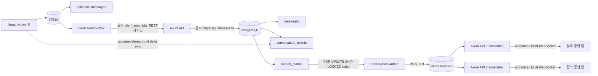

# jamye-server architecture

## 1. 목적과 현재 범위

`jamye-server`는 기존 PWA/FastAPI monorepo에서 backend를 분리하고 React Native 모바일 앱이 소비할 독립 server contract를 제공한다. 목표는 Python 구현을 Rust로 직역하는 것이 아니라 제품 의미를 보존하면서 다음 신뢰성 경계를 명시하는 것이다.

- 모바일 SQLite가 offline UI state와 client send outbox를 소유한다.
- PostgreSQL이 server authoritative state와 durable server outbox를 소유한다.
- Redis Pub/Sub은 커밋된 event의 빠른 fan-out일 뿐 원본이 아니다.
- WebSocket 누락은 PostgreSQL의 conversation event log를 읽는 REST delta sync로 복구한다.

M0는 config, structured logging, request ID, graceful shutdown, health와 실행 환경만 구현한다. 아래 전체 구조는 목표 architecture이며 각 feature는 로드맵의 owner task 전까지 production composition에 존재하지 않는다.

## 2. 배포와 코드 구조

하나의 library package와 `api`, `worker` 두 binary를 가진 modular monolith다. 처음부터 microservice 또는 많은 Cargo crate로 나누지 않는다.

```text
transport/adapters -> application -> domain
application -> ports
adapters implement ports
```

- `domain`: framework-free entity와 invariant. Axum, SQLx, Redis, S3를 import하지 않는다.
- `application`: use case, authorization 재검증, transaction boundary를 소유한다.
- `ports`: 교체 가능한 외부 system, test double, 실제 transaction ownership이 있을 때만 만든다.
- `adapters`: PostgreSQL, Redis, object storage, push 구현이다.
- `transport`: HTTP/WebSocket DTO, 인증 추출, error mapping을 담당한다.
- `platform`: config, logging, request ID, health, shutdown 같은 process concern이다.

한 줄 wrapper나 feature별 repository forest를 만들지 않는다. API와 worker composition은 compile-time에 보이는 static function call로 완성하고 runtime registry, plugin discovery, contribution interface를 두지 않는다.

## 3. 메시지 outbox와 sync engine

모바일과 서버에 모두 outbox가 있지만 같은 queue가 아니다.



### Client outbox

`jamye-app`이 SQLite transaction 하나로 optimistic message와 send intent를 기록한다. network 실패, 401 후 refresh, response 유실에도 같은 `client_msg_id`를 사용한다. 앱은 server echo/duplicate response를 canonical message로 병합하고 REST delta sync 결과도 같은 ID로 reconcile한다. 구체적인 SQLite schema와 retry scheduler는 모바일 저장소가 소유한다.

### Server transaction

인증된 `POST /api/v1/chatrooms/{chatroom_id}/messages` use case는 membership을 application 경계에서 다시 확인한다. 성공 transaction은 정확히 다음을 원자적으로 기록한다.

```text
messages
conversation_events
outbox_events
```

DB의 `UNIQUE(sender_id, client_msg_id)`가 멱등성의 최종 fence다. concurrent retry에서 conflict가 나면 새 row를 만들지 않고 기존 canonical result를 반환한다. response 유실은 committed message 유실이나 duplication으로 바뀌지 않는다.

### Server outbox worker

worker는 PostgreSQL clock과 `FOR UPDATE SKIP LOCKED`에 준하는 claim을 사용한다. Redis publish가 성공한 뒤에만 published state로 전이한다. 실패하면 durable outbox row를 남겨 재시도한다. publish 직후 worker가 죽으면 중복 publish가 가능하므로 event 소비자는 `event_id`로 idempotent해야 한다.

### WebSocket과 delta sync

Redis를 구독하는 각 API node는 자신에게 연결된 authorized client에만 event를 보낸다. WebSocket은 command의 유일한 전송 경로가 아니며 커밋된 event의 low-latency hint다. long-lived access token을 query에 넣지 않고 bearer-authenticated REST가 발급한 short-lived one-time ticket을 연결 시 소비한다.

앱은 conversation별 마지막 opaque cursor를 저장한다. reconnect와 foreground 복귀 후 `GET /api/v1/conversations/{id}/events?after={cursor}`를 page exhaustion까지 호출한다. Redis restart, API node 이동, offline 구간에 event를 놓쳐도 PostgreSQL `conversation_events`에서 복구한다.

## 4. 실패 의미론

| 장애 | write | readiness | realtime | 복구 |
|---|---|---|---|---|
| PostgreSQL | 실패 | 실패 | 기존 connection만 제한적 | DB 복구 후 정상 요청 재시도 |
| Redis | PostgreSQL commit 성공 | `degraded`, HTTP ready 유지 | 지연/누락 가능 | outbox 재발행 + REST delta sync |
| MinIO | text message 계속 동작 | `degraded`, HTTP ready 유지 | 영향 없음 | 새 media operation만 재시도 |
| WebSocket/API node | REST command 유지 | node 상태에 따름 | 연결 구간 누락 | ticket 재발급, reconnect, delta sync |

Redis queue나 in-memory hub를 authoritative state로 사용하지 않는다. push와 미래 durable job도 PostgreSQL intent가 원본이며 external provider I/O는 commit 밖에서 짧게 수행한다.

## 5. REST와 realtime contract

- public prefix: `/api/v1`
- JSON field: `snake_case`
- time: UTC ISO 8601
- ID: string UUID
- list: opaque cursor pagination
- error: `error.code`, localized safe `message`, `request_id`, nullable `details` envelope
- REST DTO와 domain entity는 별도 타입
- OpenAPI 3.1, realtime JSON Schema, fixture, reproducible checksum manifest는 server repository가 생성
- API v1은 additive change가 기본이며 current/previous mobile projection을 함께 지원

Realtime event는 `version`, `type`, `event_id`, `conversation_id`, `cursor`, `occurred_at`, `data`를 가진 discriminated union이다. C2에는 `message.created`와 membership eviction 계열의 선택된 두 variant만 들어가며 STT/transcription variant는 없다.

## 6. 인증과 권한

모바일은 browser `httpOnly` cookie를 전제로 하지 않는다. target contract는 짧은 access token, hashed rotating refresh session, Authorization Code + PKCE 또는 one-time mobile exchange code를 사용한다. redirect URI는 exact allowlist이며 wildcard를 허용하지 않는다.

모든 group resource는 transport뿐 아니라 use-case 경계에서 membership을 검증한다. object key 추측으로 다른 group media를 읽지 못하도록 object metadata와 access decision은 PostgreSQL이 소유한다. auth, invite, presign, refresh의 rate-limit 정책 위치는 application과 replaceable port 경계에 둔다.

dev auth가 필요하면 `dev-fixtures` Cargo feature와 environment guard를 둘 다 통과해야 한다. `default=[]` production composition에는 fixture route, key, issuer, acceptance path가 없어야 한다.

## 7. 미디어와 음성

MinIO bucket은 private이고 app에는 MinIO credential을 전달하지 않는다. upload intent를 DB에 기록한 뒤 short-lived presigned PUT을 발급하고, finalize에서 사용자·대상·MIME·크기·만료와 object HEAD 결과를 검증한다. 조회는 membership 검증 후 short-lived presigned GET을 재발급한다.

음성 메시지는 body 없이 정확히 audio media 한 개를 가진 일반 message다. 동일한 message transaction, history, delta sync, `message.created`, authorized presigned GET 경로를 사용한다. STT field, job, event, worker, Python runtime은 이번 작업과 C2에 없다.

MinIO의 SigV4는 `Host`를 서명하므로 ingress가 `Host`를 무조건 덮어쓰면 안 된다.

## 8. 데이터 모델 목표

첫 migration은 수직 절편에 필요한 table만 만들고 이후 owner가 forward-only additive migration을 추가한다.

- 제품: `users`, `groups`, `memberships`, `invites`, `topics`, `topic_media`, `topic_tags`, `chatrooms`, `messages`, `message_media`, `chatroom_reads`, `notifications`
- 모바일 인증: `auth_identities`, `refresh_sessions`
- push: `push_installations`
- media authorization: `media_uploads`
- 정합성: `conversation_events`, `outbox_events`
- durable provider intent: push occurrence와 account/object cleanup owner가 추가하는 table

PostgreSQL sequence 기반 cursor는 server만 생성한다. Redis와 MinIO의 상태로 message/event 존재 여부를 판정하지 않는다.

## 9. M0 process architecture

M0 environment key는 일곱 개로 제한한다. environment와 PostgreSQL URL은 필수이며 Redis/MinIO URL은 미설정 시 degraded로 동작한다. 시작 시 존재하는 값과 모든 범위를 검증하고 잘못된 설정은 명확한 safe error로 process를 종료한다.

```text
JAMYE_ENVIRONMENT
JAMYE_LISTEN_ADDR
JAMYE_SHUTDOWN_GRACE_SECONDS
JAMYE_READINESS_TIMEOUT_MS
DATABASE_URL
REDIS_URL
JAMYE_MINIO_HEALTH_URL
```

`/health/live`는 process liveness만 보고한다. `/health/ready`는 bounded timeout으로 세 dependency를 독립 확인하고 PostgreSQL만 readiness HTTP status를 결정한다. Redis/MinIO 실패는 typed degraded detail이다. log는 JSON이고 caller의 request ID를 신뢰하지 않는다. 서버가 UUID를 발급해 response와 log에 같은 ID를 전파한다. SIGTERM/SIGINT에서 listener를 닫고 configurable grace period 동안 in-flight request를 drain한다.

M0 MinIO check는 official unauthenticated `/minio/health/live` URL만 사용한다. S3 SDK, bucket, region, credential, path-style은 task-8 전까지 config/Cargo graph/composition에 없다.

## 10. Nix와 운영 책임

`rust-toolchain.toml`이 exact Rust value의 유일한 원본이고 flake는 Fenix로 그 파일을 한 번 읽어 devShell과 Crane package에 같은 derivation을 넘긴다. flake input, Cargo 외 도구, native dependency는 `flake.lock`이 고정한다.

지원 system은 `aarch64-darwin` development와 `x86_64-linux` production이다. macOS에 Linux builder가 없으면 production package matrix는 blocker이며 skip 성공이 아니다.

Rootless Podman Compose는 local disposable PostgreSQL/Redis/MinIO만 제공한다. production은 task-13의 native Nix package와 NixOS systemd module이며, 실제 host/secret/service/volume/ingress/monitoring/backup/restore는 별도 homelab repository가 소유한다.
